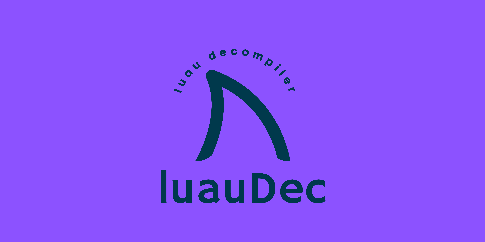

# luauDec

Decompiler for Luau (https://luau-lang.org/) written by xgladius

luauDec is a decompiler for the Luau language created by Roblox, leveraging built-in Luau tooling to generate AST, and then transpile that AST into readable code.

# Introduction

The decompiler was designed to have a few things in mind,

***No dependencies*** - Other than the Luau language, luauDec has 0 dependencies other than the C++ STL.

***Easy to understand and use*** - The code is written in a way that anyone can understand it, given they understand C++ of course.

***Speed*** - The decompiler does not invoke the Luau VM, (like some other decompilers), allowing for it to be incredibly fast.

***Multi-platform*** - Works on all platforms.

# Building

1. `git clone --recursive https://github.com/xgladius/luauDec.git`
2. `cd luauDec`
3. `cmake . && make`

## How it works

1. Luau bytecode is fed into the decompiler
   - The decompiler calls luau_load to produce an LClosure with a Proto member
2. The decompiler iterates over each child Proto (Proto->p) which are passed to the decompiler's BlockGen<false> class (BlockGen<false> meaning non-main Proto)
   - The BlockGen<false> class creates a AstExprFunction for each child Proto, which is added to a vector
     - Proto->code is iterated here to create Ast expressions of the relevant code
3. The decompiler passes the main Proto, along with the vector of child Proto AstExprFunction to the decompilers BlockGen<true> class (BlockGen<true> meaning main Proto)
   - The BlockGen<true> class creates a AstStatBlock containing all uses of code in Proto->code and child Protos
4. The AstStatBlock is passed to Luau's built-in transpiler, which is turned into valid Luau code
 
### Feature list

- [x] StatBlock AST generation
- [x] Basic arithmetic AST generation (+, -, *, /, %, etc)
- [x] Reading and writing from constants table AST generation (Proto->k[idx] to AST)
- [x] Call AST generation (print())
  - [x] Arguments (print(1,2,3,4,5,6)
  - [x] Vararg argument (print(...))
- [x] Function AST generation (Proto->p nested subprotos) (function x() print'a' end x())
  - [x] Newclosure AST generation
- [x] Return AST generation
  - [x] Normal returns (return 1)
  - [x] Vararg return (return 1,2,3,4)
- [x] Table AST generation
  - [x] Setlist support (x = {1, 2, 3, 4})
  - [x] Newtable support (x = {})
  - [x] Settable support (x[1] = 1)
- [x] Local variable AST generation
  - [ ] "Smart" local variable names
- [x] Numeric for loops (for i=1, 10 do end)
  - [x] Nested numeric for loops (for i=1, 10 do for x=1, 100 do end end)
- [ ] Range based for loops (for i,v in pairs() do end)
  - [ ] Nested range based for loops
- [x] if statements
  - [x] if then (if true then end)
  - [ ] Nested if statements
  - [ ] else
  - [ ] elseif
- [x] while statements
  - [x] Nested while statements
